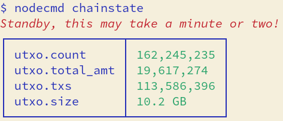
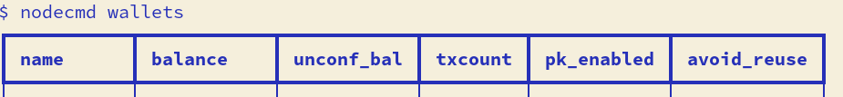
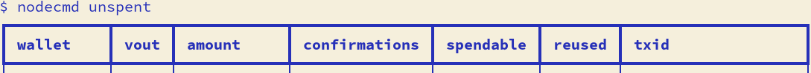

### node-cmd
---

Command line tool that aggregates information from the Bitcoin RPC.

#### Setup
1. *Don't trust, verify*: audit the code thoroughly.
2. Clone and install requirements:
```
    git clone https://github.com/ns-xvrn/node-cmd.git &&
    cd node-cmd &&
    cp settings.conf.sample settings.conf &&
    pip install -r requirements.txt
```
3. Setup config file: edit the `settings.conf` file

---

#### info - live view
`python node_cmd.py info` or `python node_cmd.py`

NOTE: only price fetch is a non Bitcoin rpc fetch, you can disable it in `settings.conf` with `enable_price_fetch=0`


#### chainstate (utxo summary)
`python node_cmd.py chainstate`



#### wallets summary
`python node_cmd.py wallets`



#### unspent (wallet utxos)
`python node_cmd.py unspent`


